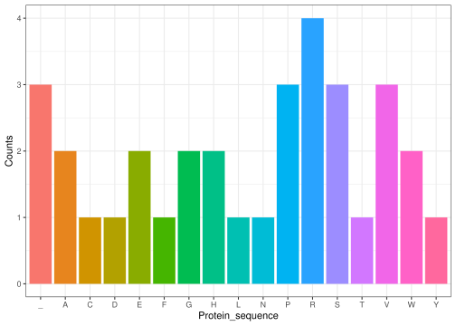

centraldogma
================

<!-- README.md is generated from README.Rmd. Please edit that file -->

## Overview

The **centraldogma** package enables you to simulate and process DNA
sequences into RNA, codons, and amino acids, ending with a barplot of
amino acid counts. This vignette demonstrates the five functions in the
package.

### Step 1: Generate a DNA Sequence

We start by generating a random DNA sequence of a specified length.
Here, `generate_sequence()` takes a single parameter, `sequence_length`,
and returns a random DNA sequence.

``` r
# Generate a random DNA sequence
sequence_length <- 100
dna_sequence <- generate_sequence(sequence_length)
dna_sequence
#> [1] "TGGCCCCTCAAACTGTTCAAGCACTTACTAAAGCTATCATCTTTAAGTAATACAACCGTCAGATAAGTTACATCTGGATCAAAAGCCCGAAACATTTCGT"
```

### Step 2: Transcription - Converting DNA to RNA

The `transcription()` function converts the DNA sequence to an RNA
sequence by replacing thymine (T) with uracil (U).

``` r
# Transcribe the DNA sequence to RNA
rna_sequence <- transcription(dna_sequence)
rna_sequence
#> [1] "UGGCCCCUCAAACUGUUCAAGCACUUACUAAAGCUAUCAUCUUUAAGUAAUACAACCGUCAGAUAAGUUACAUCUGGAUCAAAAGCCCGAAACAUUUCGU"
```

### Step 3: Convert RNA to Codons

The `RNA_to_codon()` function splits the RNA sequence into codons
(groups of three nucleotides). By default, the function starts at the
first position.

``` r
# Convert RNA sequence to codons
codons <- RNA_to_codon(rna_sequence)
codons
#>  [1] "UGG" "CCC" "CUC" "AAA" "CUG" "UUC" "AAG" "CAC" "UUA" "CUA" "AAG" "CUA"
#> [13] "UCA" "UCU" "UUA" "AGU" "AAU" "ACA" "ACC" "GUC" "AGA" "UAA" "GUU" "ACA"
#> [25] "UCU" "GGA" "UCA" "AAA" "GCC" "CGA" "AAC" "AUU" "UCG"
```

### Step 4: Translate Codons to Amino Acids

With `aa_sequence()`, the codons are translated into their corresponding
amino acids. This function requires a predefined **codon table** named
`codon_table` that maps each codon to an amino acid.

``` r
# Translate codons to amino acid sequence
amino_acid_sequence <- aa_sequence(codons)
amino_acid_sequence
#> [1] "WPLKLFKHLLKLSSLSNTTVR_VTSGSKARNIS"
```

### Step 5: Visualize Amino Acid Counts

Finally, `colplot_number_aa_in_protseq()` takes the amino acid sequence
and generates a barplot of amino acid counts.

``` r
# Plot amino acid counts
colplot_number_aa_in_protseq(amino_acid_sequence)
```


