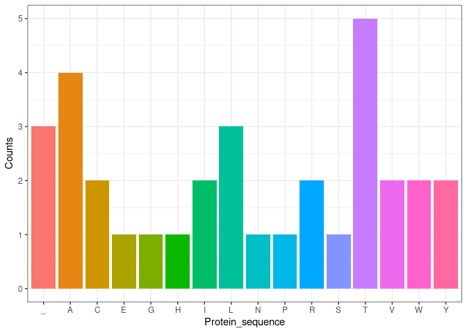

centraldogma
================

<!-- README.md is generated from README.Rmd. Please edit that file -->

Link to group 21 repository:
<https://github.com/rforbiodatascience24/group_21_package/tree/master>

## Overview

The **centraldogma** package enables you to simulate and process DNA
sequences into RNA, codons, and amino acids, ending with a barplot of
amino acid counts. This vignette demonstrates the five functions in the
package.

### Step 1: Generate a DNA Sequence

We start by generating a random DNA sequence of a specified length.
Here, `generate_sequence()` takes a single parameter, `sequence_length`,
and returns a random DNA sequence.

``` r
# Generate a random DNA sequence
sequence_length <- 100
dna_sequence <- generate_sequence(sequence_length)
dna_sequence
#> [1] "CGGTGGATTGTCTGCACCAGTATACTTACCTGGGTTGCCGAGACGGCCTGTAACGCCTGACTCACCGCCTACTACTTAACTTAAAGACACTAACCCGGTT"
```

### Step 2: Transcription - Converting DNA to RNA

The `transcription()` function converts the DNA sequence to an RNA
sequence by replacing thymine (T) with uracil (U).

``` r
# Transcribe the DNA sequence to RNA
rna_sequence <- transcription(dna_sequence)
rna_sequence
#> [1] "CGGUGGAUUGUCUGCACCAGUAUACUUACCUGGGUUGCCGAGACGGCCUGUAACGCCUGACUCACCGCCUACUACUUAACUUAAAGACACUAACCCGGUU"
```

### Step 3: Convert RNA to Codons

The `RNA_to_codon()` function splits the RNA sequence into codons
(groups of three nucleotides). By default, the function starts at the
first position.

``` r
# Convert RNA sequence to codons
codons <- RNA_to_codon(rna_sequence)
codons
#>  [1] "CGG" "UGG" "AUU" "GUC" "UGC" "ACC" "AGU" "AUA" "CUU" "ACC" "UGG" "GUU"
#> [13] "GCC" "GAG" "ACG" "GCC" "UGU" "AAC" "GCC" "UGA" "CUC" "ACC" "GCC" "UAC"
#> [25] "UAC" "UUA" "ACU" "UAA" "AGA" "CAC" "UAA" "CCC" "GGU"
```

### Step 4: Translate Codons to Amino Acids

With `aa_sequence()`, the codons are translated into their corresponding
amino acids. This function requires a predefined **codon table** named
`codon_table` that maps each codon to an amino acid.

``` r
# Translate codons to amino acid sequence
amino_acid_sequence <- aa_sequence(codons)
amino_acid_sequence
#> [1] "RWIVCTSILTWVAETACNA_LTAYYLT_RH_PG"
```

### Step 5: Visualize Amino Acid Counts

Finally, `colplot_number_aa_in_protseq()` takes the amino acid sequence
and generates a barplot of amino acid counts.

``` r
# Plot amino acid counts
colplot_number_aa_in_protseq(amino_acid_sequence)
```



## Use cases

The **centraldogma** package is small and specific, making it a good
package used for educational purposes. It provides a simple way for
students and teachers to understand the central dogma of molecular
biology by visually representing the process from DNA to protein.
Furthermore, the package can also be used as a bioinformatic tool for
easily discovering the pattern of amino acids in given DNA, RNA, or
amino acid sequences.

## Future package potentials

While the **centraldogma** package currently provides essential
functions, several additional features could enhance its utility. Such
feature could be mutatuon simulation, a function to simulate mutations
in DNA sequences for further analysing their effect on the protein
sequence. Another potential feature could be an expanded codon table,
which would include additional genetic codes for organisms that uses
non-standarda codons. Lastly, a protein structure prediction function
could be implemented to examine the potential protein structure of your
protein.

## A concluding mark

Even though there is a unlimited potential in expanding packages such as
**centraldogma** it is important to limit the dependencies in the
package to ensure a more efficient and maintainable package and a more
user-friendly experience.  
To provide such user-friendly experience, it is important tp consider
the pros and cons of choosing between the `@importFrom` and
`package::function()`. Using `@importFrom` enhances code readability and
performance by allowing direct function calls, but it can obscure
function origins and cause confusion with similarly named functions. In
contrast, `package::function()` clarifies function sources and avoids
namespace conflicts, making dependencies clearer for users, so a balance
between both methods can improve maintainability.
